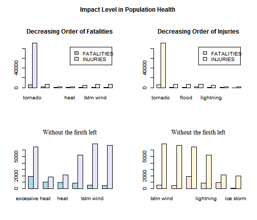
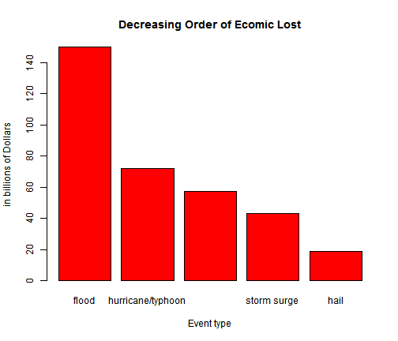

# ¡ DANGER TORNADOES & FLOODS !  
## The Twister caused more deaths and the Floods causes more material losses in the last 60 years than any other weather phenomenon.
**by Francisco J. Álvarez-Vargas**
========================================================

## SYNOPSIS
Storms and other severe weather events can cause both public health and economic problems for communities and municipalities. Many severe events can result in fatalities, injuries, and property damage, and preventing such outcomes to the extent possible is a key concern.

The U.S. National Oceanic and Atmospheric Administration's (NOAA) storm database, tracks characteristics of major storms and weather events in the United States, including when and where they occur, as well as estimates of any fatalities, injuries, and property damage. The events in the database start in the year 1950 and end in November 2011. 

I analyzed this database to find events that cause more damage to the health of people and produce the greatest property damage.

## DATA PROCESSING
**----------< Packages used >----------**

```r
library(plyr)
```


**----------< Read Data >----------**
Reviewing the pdf accompanying data, data.book, necessary for the analysis variables are selected. So only the columns corresponding to these variables are passed to data.frame data: 
- "EVTYPE", type of event.
- "FATALITIES", number of fatal events.
- "INJURIES", number of nonfatal personal lessons.
- "PROPDMG", economic damage to property.
- "PROPDMGEXP", order of magnitude of property damage.
- "CROPDMG", economic damage to crops.
- "CROPDMGEXP", order of magnitude of crop damage.


```r
setwd("D:/aToCoursera")
data.file <- "repdata-data-StormData.csv.bz2"
if (!file.exists(data.file)) {
    download.file("https://d396qusza40orc.cloudfront.net/\n                      repdata%2Fdata%2FStormData.csv.bz2", 
        data.file)
}
data <- read.csv(data.file, header = T, stringsAsFactors = T, nrows = 5)
vars.target = c("EVTYPE", "FATALITIES", "INJURIES", "PROPDMG", "PROPDMGEXP", 
    "CROPDMG", "CROPDMGEXP")
columns.target <- names(data) %in% vars.target
data <- read.csv(data.file, header = T, stringsAsFactors = T)[columns.target]
data$PROPDMGEXP <- as.character(data$PROPDMGEXP)
data$CROPDMGEXP <- as.character(data$CROPDMGEXP)
```


**----------< Preparing Data >----------**
For analysis about population health:

I use a database for the assessment of events according to the attacks on human health. And another database for the assessment of the events regarding the economic damage. The two data frames are subsets of the previously read data.


```r
data.PopulationDMG <- subset(data, FATALITIES > 0 | INJURIES > 0, select = c("EVTYPE", 
    "FATALITIES", "INJURIES"))
data.PopulationDMG$EVTYPE <- tolower(data.PopulationDMG$EVTYPE)
# (fatalities, injuries) by event type
FATALITIES.sum <- aggregate(FATALITIES ~ EVTYPE, data = data.PopulationDMG, 
    FUN = sum)
FATALITIES.sum <- FATALITIES.sum[with(FATALITIES.sum, order(-FATALITIES)), ]

INJURIES.sum <- aggregate(INJURIES ~ EVTYPE, data = data.PopulationDMG, FUN = sum)
INJURIES.sum <- INJURIES.sum[with(INJURIES.sum, order(-INJURIES)), ]
```


For analysis about economic impact:

To have the same base monetary, economic injury damages multiplied by 10 to the corresponding order of magnitude. The orders of magnitude are converted to numbers: h, H, are one hundred (order 2), k, K are thousand (order 3), m, M are million (order 6) ... For some values reported as appears magnitude by a "-" or "+", or, or NA, "?" in these cases, I assume that the order of magnitude is 1. 

The total financial loss is calculated as the sum of the loss from property damage plus loss for damage to crops, totaled for each event.


```r
data.EconomicDMG <- subset(data, PROPDMG > 0 | CROPDMG > 0, select = c("EVTYPE", 
    "PROPDMG", "PROPDMGEXP", "CROPDMG", "CROPDMGEXP"))
data.EconomicDMG$EVTYPE <- tolower(data.EconomicDMG$EVTYPE)

multiply <- c(10^(0:9), 10^2, 10^2, 10^3, 10^3, 10^6, 10^6, 10^9, 10^9, 1, 1, 
    1, 1)
names(multiply) <- c(0:9, "h", "H", "k", "K", "m", "M", "b", "B", "-", "+", 
    "?", NA)
data.EconomicDMG$PROPDMGnew <- multiply[data.EconomicDMG$PROPDMGEXP] * data.EconomicDMG$PROPDMG
data.EconomicDMG$CROPDMGnew <- multiply[data.EconomicDMG$CROPDMGEXP] * data.EconomicDMG$CROPDMG

# damage (property, crop, total) by event type
PROPDMG.sum <- aggregate(PROPDMGnew ~ EVTYPE, data = data.EconomicDMG, FUN = sum)
PROPDMG.sum <- PROPDMG.sum[with(PROPDMG.sum, order(-PROPDMGnew)), ]

CROPDMG.sum <- aggregate(CROPDMGnew ~ EVTYPE, data = data.EconomicDMG, FUN = sum)
CROPDMG.sum <- CROPDMG.sum[with(CROPDMG.sum, order(-CROPDMGnew)), ]
```


## RESULTS
Now, I can calculated the impact of different types of events in both, population and economy:

**----------< Q1: Population Healt >----------**

```r
rpta.Q1 <- arrange(join(FATALITIES.sum, INJURIES.sum), EVTYPE)
```

```
## Joining by: EVTYPE
```

```r

rpta.Q1a <- rpta.Q1[with(rpta.Q1, order(-FATALITIES)), ]
row.names(rpta.Q1a) <- rpta.Q1a[, 1]
rpta.Q1a[, 1] <- NULL

rpta.Q1b <- rpta.Q1[with(rpta.Q1, order(-INJURIES)), ]
row.names(rpta.Q1b) <- rpta.Q1b[, 1]
rpta.Q1b[, 1] <- NULL
```


Summarizing in two tables. First, in Table No. 1, the Top-10 of the events that cause deaths:


```r
head(rpta.Q1a, 10)
```

```
##                FATALITIES INJURIES
## tornado              5633    91346
## excessive heat       1903     6525
## flash flood           978     1777
## heat                  937     2100
## lightning             816     5230
## tstm wind             504     6957
## flood                 470     6789
## rip current           368      232
## high wind             248     1137
## avalanche             224      170
```


and, in Table No. 2, the Top-10 of the events that cause personal injurys:


```r
head(rpta.Q1b, 10)
```

```
##                   FATALITIES INJURIES
## tornado                 5633    91346
## tstm wind                504     6957
## flood                    470     6789
## excessive heat          1903     6525
## lightning                816     5230
## heat                     937     2100
## ice storm                 89     1975
## flash flood              978     1777
## thunderstorm wind        133     1488
## hail                      15     1361
```


Notably, tornadoes are leading the two lists. Excessive heat occupies a remarkable position in both.


```r
par(mfrow = c(2, 2))
par(mar = c(5.1, 4.1, 4.1, 2.1))
par(oma = c(0, 0, 3, 0))

tmp.arrayL <- head(rpta.Q1a, 7)
tmp.arrayL <- t(tmp.arrayL)
barplot(tmp.arrayL, beside = TRUE, col = c("lightblue", "lavender"), legend = rownames(tmp.arrayL))
title(main = "Decreasing Order of Fatalities", font.main = 2)

tmp.arrayR <- head(rpta.Q1b, 7)
tmp.arrayR <- t(tmp.arrayR)
barplot(tmp.arrayR, beside = TRUE, col = c("mistyrose", "cornsilk"), legend = rownames(tmp.arrayR))
title(main = "Decreasing Order of Injuries", font.main = 2)

barplot(tmp.arrayL[, -1], beside = TRUE, col = c("lightblue", "lavender"))
title(main = "Without the firsth left", font.main = 6)

barplot(tmp.arrayR[, -1], beside = TRUE, col = c("mistyrose", "cornsilk"))
title(main = "Without the firsth left", font.main = 6)

title(main = "Impact Level in Population Health", outer = T, font.main = 2)
```

 


**----------< Q2: Economic Impact >----------**

```r
rpta.Q2 <- arrange(join(PROPDMG.sum, CROPDMG.sum), EVTYPE)
```

```
## Joining by: EVTYPE
```

```r
rpta.Q2[, 2:3] <- rpta.Q2[, 2:3]/1e+09
names(rpta.Q2) <- c("EVTYPE", "Property", "Crop")
rpta.Q2$Total <- rpta.Q2$Property + rpta.Q2$Crop

rpta.Q2a <- rpta.Q2[with(rpta.Q2, order(-Property)), ]
row.names(rpta.Q2a) <- rpta.Q2a[, 1]
rpta.Q2a[, 1] <- NULL

rpta.Q2b <- rpta.Q2[with(rpta.Q2, order(-Crop)), ]
row.names(rpta.Q2b) <- rpta.Q2b[, 1]
rpta.Q2b[, 1] <- NULL

rpta.Q2t <- rpta.Q2[with(rpta.Q2, order(-Total)), ]
row.names(rpta.Q2t) <- rpta.Q2t[, 1]
rpta.Q2t[, 1] <- NULL
```


In Table No. 3, the Top-10 events in economic impact, defined like the sum of properties damage and crop damage. The first two columns represent the percentages of damage to property and crop damage for the total of each event. The TOTAL values are in billion of dollars:

```r
tmp <- head(rpta.Q2t, 10)
tmp[, 1] <- tmp[, 1]/tmp[, 3] * 100
tmp[, 2] <- tmp[, 2]/tmp[, 3] * 100
names(tmp) <- c("Property [%]", "Crop [%]", "TOTAL")
tmp
```

```
##                   Property [%]  Crop [%]   TOTAL
## flood                   96.233 3.767e+00 150.320
## hurricane/typhoon       96.374 3.626e+00  71.914
## tornado                 99.277 7.234e-01  57.362
## storm surge            100.000 1.154e-05  43.324
## hail                    83.871 1.613e+01  18.761
## flash flood             92.209 7.791e+00  18.244
## drought                  6.965 9.303e+01  15.019
## hurricane               81.233 1.877e+01  14.610
## river flood             50.441 4.956e+01  10.148
## ice storm               43.994 5.601e+01   8.967
```


In tables Nos. 4, and 5, I show the Top-10 events respect to properties damage or crop damage respectively, all values are in billion of dollars:

```r
head(rpta.Q2a, 10)
```

```
##                   Property     Crop   Total
## flood              144.658 5.661968 150.320
## hurricane/typhoon   69.306 2.607873  71.914
## tornado             56.947 0.414953  57.362
## storm surge         43.324 0.000005  43.324
## flash flood         16.823 1.421317  18.244
## hail                15.735 3.025954  18.761
## hurricane           11.868 2.741910  14.610
## tropical storm       7.704 0.678346   8.382
## winter storm         6.688 0.026944   6.715
## high wind            5.270 0.638571   5.909
```


```r
head(rpta.Q2b, 10)
```

```
##                    Property   Crop   Total
## drought             1.04611 13.973  15.019
## flood             144.65771  5.662 150.320
## river flood         5.11895  5.029  10.148
## ice storm           3.94493  5.022   8.967
## hail               15.73527  3.026  18.761
## hurricane          11.86832  2.742  14.610
## hurricane/typhoon  69.30584  2.608  71.914
## flash flood        16.82267  1.421  18.244
## extreme cold        0.06774  1.313   1.381
## frost/freeze        0.01048  1.094   1.105
```


For the total economic impact, I present the same data of Table No. 3, in the Fig. No. 2:


```r
tmp.array <- head(rpta.Q2t, 5)
tmp.array <- t(tmp.array)
par(mfrow = c(1, 1))
barplot(tmp.array[3, ], beside = TRUE, col = c("red"), xlab = "Event type", 
    ylab = "in billions of Dollars")
title(main = "Decreasing Order of Ecomic Lost", font.main = 2)
```

 


